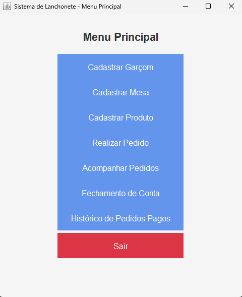
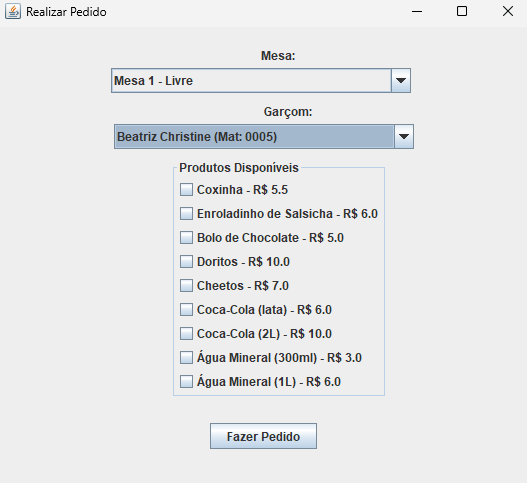
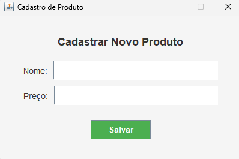
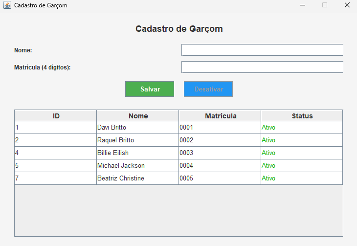

# Sistema de Gestão de Lanchonete 🍔
Sistema desktop/web (GUI em Java) com gerenciamento de clientes, pedidos, estoque e relatórios. Banco de dados: MySQL.

## Funcionalidades
- Cadastro de produtos
- Controle de garçons (cadastro, remoção, alteração).
- Controle de mesas.
- Controle de cardápio.
- Controle e acompanhamento de pedidos.
- Fechamento de conta com serviço e cálculo por pessoa.
- Histórico de pedidos pagos.

## Stack
- Java (Swing)  
- MySQL

## Como executar
1. Importar no IDE (IntelliJ/Eclipse/NetBeans).  
2. Configurar `db.properties` com credenciais do MySQL.  
3. Executar `Main.java`.

## Fotos do sistema:

  Menu &nbsp;&nbsp;&nbsp;&nbsp; | &nbsp;&nbsp;&nbsp;&nbsp; Tela Pedidos

  
  

  Cadastro de Produtos &nbsp;&nbsp;&nbsp;&nbsp; | &nbsp;&nbsp;&nbsp;&nbsp; Cadastro de Garçons

  
  

## 📄 Licença
Este projeto foi desenvolvido por **Beatriz Christine Azevedo Batista**  
e está licenciado sob a **Licença MIT** — veja o arquivo [LICENSE](LICENSE) para mais detalhes.
